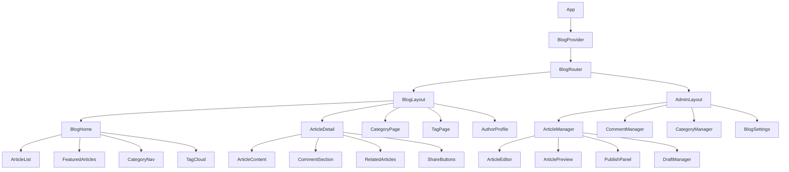
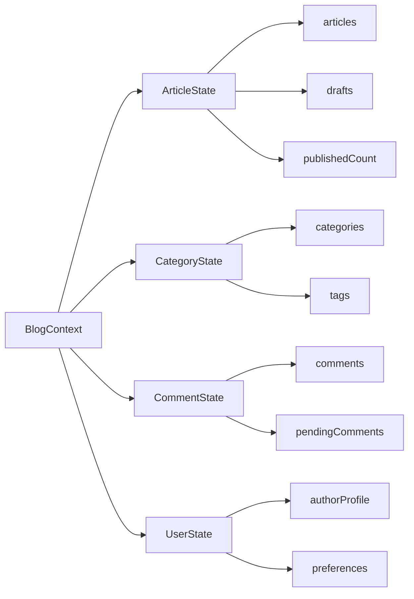
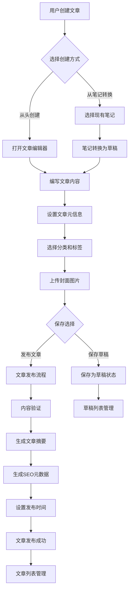
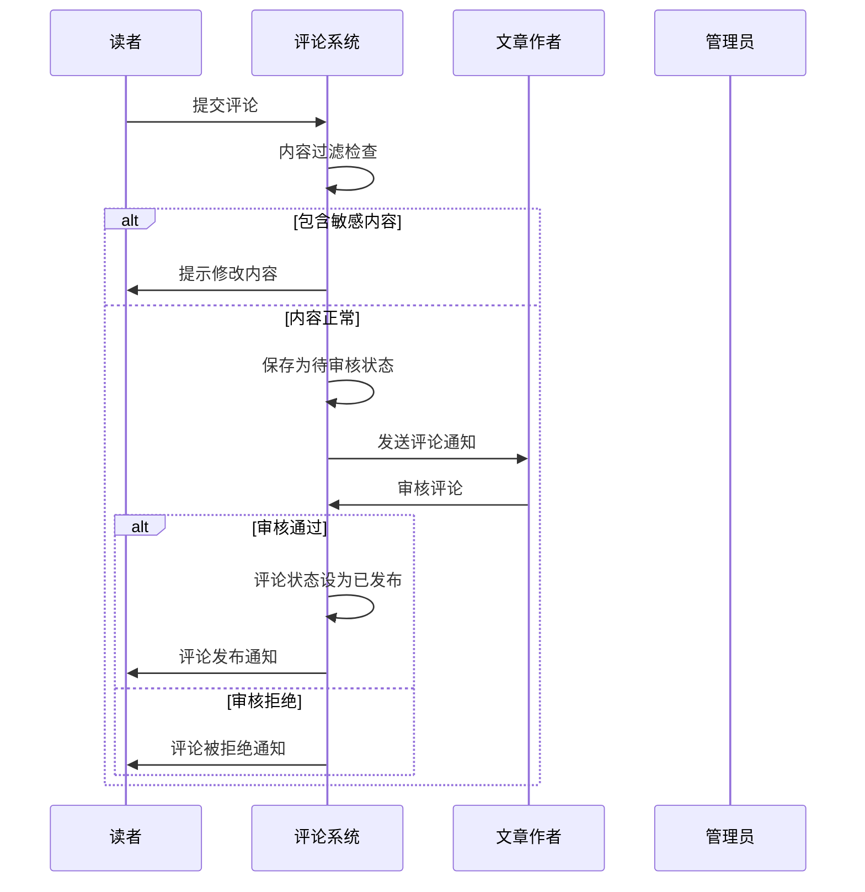
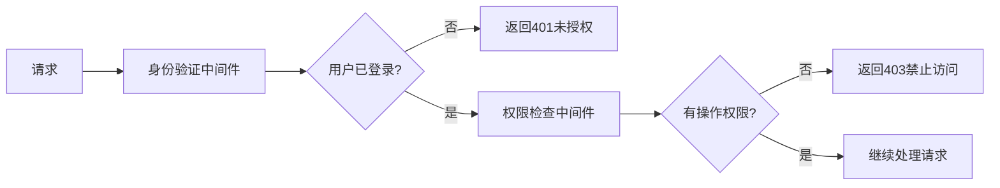

# 博客功能实现设计

## 概述

基于现有的笔记管理系统，扩展实现博客功能。将私人笔记转换为可公开发布的博客文章，支持文章管理、分类标签、评论互动和文章发布等核心博客功能。

### 核心价值
- **内容转化**：将私人笔记无缝转换为公开博客文章
- **发布管理**：提供完整的文章发布、编辑、管理流程
- **社交互动**：支持读者评论、点赞等互动功能
- **SEO优化**：生成搜索引擎友好的文章页面

### 目标用户
- 现有笔记管理系统用户（内容创作者）
- 博客读者（访客用户）
- 博客评论者（注册用户）

## 技术栈与依赖

### 现有技术栈
- **前端框架**：React 19.1.1 + TypeScript
- **状态管理**：React Context + Hooks
- **UI组件**：Lucide React图标库
- **表单处理**：React Hook Form + Zod验证
- **HTTP客户端**：Axios
- **构建工具**：Vite
- **测试框架**：Vitest + Testing Library

### 新增依赖需求
- **富文本编辑器**：用于博客文章编辑
- **Markdown解析**：支持Markdown格式文章
- **代码高亮**：文章代码块语法高亮
- **图片处理**：文章图片上传和管理
- **SEO工具**：元数据管理和页面优化

## 组件架构

### 组件层次结构



### 核心组件定义

#### BlogProvider（博客上下文提供者）
- **职责**：管理全局博客状态和数据
- **状态管理**：文章列表、分类、标签、用户偏好
- **数据同步**：与现有笔记系统的数据同步

#### BlogRouter（博客路由管理）
- **职责**：处理博客相关页面路由
- **路由策略**：SEO友好的URL结构
- **访问控制**：区分公开页面和管理页面

#### ArticleEditor（文章编辑器）
- **职责**：提供富文本编辑功能
- **编辑模式**：支持所见即所得和Markdown模式
- **实时预览**：边写边预览功能
- **自动保存**：防止内容丢失

#### CommentSection（评论系统）
- **职责**：处理文章评论功能
- **嵌套评论**：支持多层级回复
- **审核机制**：评论发布前审核
- **互动功能**：点赞、举报等

## 路由与导航

### URL结构设计

| 页面类型 | URL模式 | 描述 |
|---------|---------|------|
| 博客首页 | `/blog` | 文章列表主页 |
| 文章详情 | `/blog/article/{slug}` | 单篇文章页面 |
| 分类页面 | `/blog/category/{category}` | 分类文章列表 |
| 标签页面 | `/blog/tag/{tag}` | 标签文章列表 |
| 作者主页 | `/blog/author/{username}` | 作者文章列表 |
| 管理后台 | `/admin/blog` | 博客管理入口 |
| 文章管理 | `/admin/blog/articles` | 文章管理页面 |
| 评论管理 | `/admin/blog/comments` | 评论管理页面 |

### 导航策略
- **面包屑导航**：清晰的页面层级导航
- **侧边栏导航**：分类和标签快速导航
- **搜索功能**：全文搜索和筛选功能

## 样式策略

### 设计系统扩展
- **博客主题**：基于现有设计系统扩展博客主题色彩
- **响应式布局**：适配桌面、平板、手机三种设备
- **阅读体验**：优化文章阅读的字体、行距、色彩对比

### CSS组织结构
```
src/styles/
├── blog/
│   ├── blog-base.css          # 博客基础样式
│   ├── article.css            # 文章页面样式
│   ├── editor.css             # 编辑器样式
│   ├── comments.css           # 评论系统样式
│   └── admin.css              # 管理后台样式
```

## 状态管理

### Blog Context设计



### 状态管理策略
- **数据分离**：博客数据与笔记数据独立管理
- **缓存策略**：前端缓存减少API调用
- **乐观更新**：提升用户交互响应速度

## API端点参考

### 文章相关接口

| 方法 | 端点 | 描述 | 请求参数 |
|-----|------|------|----------|
| GET | `/api/blog/articles` | 获取文章列表 | page, limit, category, tag |
| GET | `/api/blog/articles/{id}` | 获取文章详情 | - |
| POST | `/api/blog/articles` | 创建文章 | title, content, category, tags |
| PUT | `/api/blog/articles/{id}` | 更新文章 | title, content, category, tags |
| DELETE | `/api/blog/articles/{id}` | 删除文章 | - |
| POST | `/api/blog/articles/{id}/publish` | 发布文章 | publishAt |

### 评论相关接口

| 方法 | 端点 | 描述 | 请求参数 |
|-----|------|------|----------|
| GET | `/api/blog/comments` | 获取评论列表 | articleId, page |
| POST | `/api/blog/comments` | 创建评论 | articleId, content, parentId |
| PUT | `/api/blog/comments/{id}` | 更新评论 | content |
| DELETE | `/api/blog/comments/{id}` | 删除评论 | - |
| POST | `/api/blog/comments/{id}/approve` | 审核评论 | - |

### 认证要求
- **公开接口**：文章列表、文章详情、评论查看无需认证
- **用户接口**：评论发布需要用户登录
- **管理接口**：文章管理、评论审核需要作者权限

## 数据模型与ORM映射

### Article（博客文章）数据模型

| 字段名 | 类型 | 描述 | 约束 |
|--------|------|------|------|
| id | string | 文章唯一标识 | 主键，UUID |
| title | string | 文章标题 | 必填，最大200字符 |
| slug | string | URL友好标识符 | 唯一，自动生成 |
| content | string | 文章内容 | 必填，支持Markdown |
| excerpt | string | 文章摘要 | 可选，自动提取 |
| coverImage | string | 封面图片URL | 可选 |
| status | enum | 发布状态 | draft/published/archived |
| publishedAt | Date | 发布时间 | 可选 |
| authorId | string | 作者ID | 必填，外键 |
| categoryId | string | 分类ID | 必填，外键 |
| tags | string[] | 标签列表 | 可选 |
| viewCount | number | 浏览次数 | 默认0 |
| likeCount | number | 点赞数 | 默认0 |
| commentCount | number | 评论数 | 默认0 |
| createdAt | Date | 创建时间 | 自动生成 |
| updatedAt | Date | 更新时间 | 自动更新 |

### Comment（评论）数据模型

| 字段名 | 类型 | 描述 | 约束 |
|--------|------|------|------|
| id | string | 评论唯一标识 | 主键，UUID |
| content | string | 评论内容 | 必填，最大1000字符 |
| articleId | string | 所属文章ID | 必填，外键 |
| authorId | string | 评论者ID | 必填，外键 |
| parentId | string | 父评论ID | 可选，用于嵌套回复 |
| status | enum | 审核状态 | pending/approved/rejected |
| likeCount | number | 点赞数 | 默认0 |
| createdAt | Date | 评论时间 | 自动生成 |
| updatedAt | Date | 更新时间 | 自动更新 |

### Category（分类）数据模型

| 字段名 | 类型 | 描述 | 约束 |
|--------|------|------|------|
| id | string | 分类唯一标识 | 主键，UUID |
| name | string | 分类名称 | 必填，唯一 |
| slug | string | URL标识符 | 必填，唯一 |
| description | string | 分类描述 | 可选 |
| color | string | 分类颜色 | 可选，十六进制色值 |
| parentId | string | 父分类ID | 可选，支持嵌套分类 |
| sortOrder | number | 排序顺序 | 默认0 |
| articleCount | number | 文章数量 | 自动计算 |
| createdAt | Date | 创建时间 | 自动生成 |

### 与现有Note模型的关系
- **数据转换**：Note可以转换为Article的draft状态
- **内容继承**：title、content、tags字段直接映射
- **状态区分**：通过不同的数据模型区分私人笔记和公开博客

## 业务逻辑层架构

### 文章管理功能架构



### 评论系统业务流程



### 内容发布策略
- **即时发布**：内容审核通过后立即发布
- **定时发布**：设置未来时间点自动发布
- **草稿管理**：支持多版本草稿保存和恢复

### 搜索与索引
- **全文搜索**：文章标题、内容、标签的模糊搜索
- **分类筛选**：按分类、标签、作者、时间范围筛选
- **热门排序**：按阅读量、点赞数、评论数排序

## 中间件与拦截器

### 权限控制中间件



### 中间件功能说明

| 中间件名称 | 功能描述 | 应用场景 |
|-----------|----------|----------|
| 身份验证中间件 | 验证用户登录状态 | 所有需要登录的接口 |
| 权限检查中间件 | 检查用户操作权限 | 文章管理、评论审核 |
| 内容过滤中间件 | 过滤敏感内容 | 文章发布、评论提交 |
| 频率限制中间件 | 防止恶意请求 | 评论提交、文章发布 |
| 日志记录中间件 | 记录操作日志 | 所有关键操作 |
| 缓存处理中间件 | 处理缓存逻辑 | 文章列表、文章详情 |

### 请求拦截器
- **请求预处理**：自动添加认证头、请求ID
- **响应后处理**：统一错误处理、数据格式化
- **缓存管理**：智能缓存策略和缓存失效

## 测试策略

### 组件测试覆盖

| 组件类别 | 测试重点 | 测试工具 |
|----------|----------|----------|
| 文章编辑器 | 内容编辑、格式化、自动保存 | Jest + Testing Library |
| 评论系统 | 评论提交、嵌套回复、审核流程 | Jest + Testing Library |
| 文章列表 | 分页、筛选、排序功能 | Jest + Testing Library |
| 权限控制 | 访问控制、角色权限验证 | Jest |

### 端到端测试场景
- **文章发布流程**：从创建到发布的完整流程
- **用户交互流程**：浏览、评论、分享的用户体验
- **管理功能流程**：文章管理、评论审核的管理操作

### 性能测试
- **页面加载性能**：首屏加载时间、资源优化
- **搜索性能**：大量文章情况下的搜索响应时间
- **并发处理**：高并发访问下的系统稳定性

### 测试数据管理
- **测试数据生成**：自动生成测试用的文章、评论数据
- **数据隔离**：测试环境与生产环境数据隔离
- **清理策略**：测试完成后自动清理测试数据