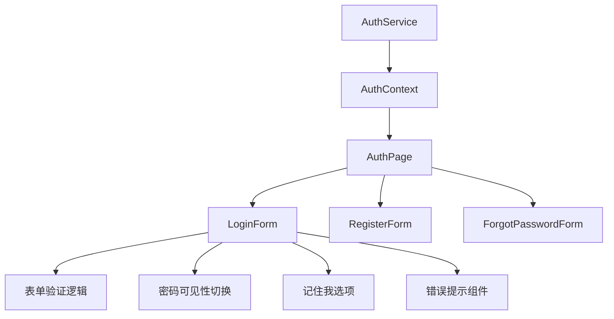
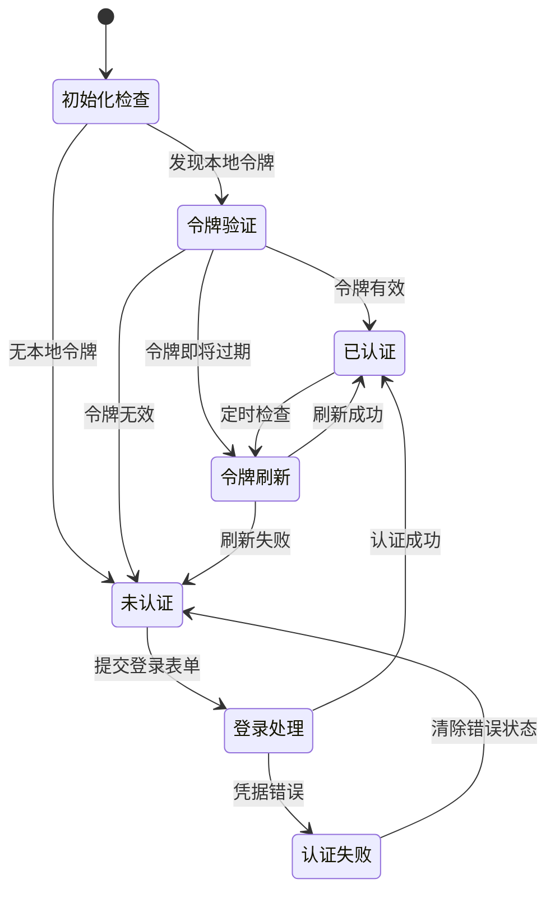
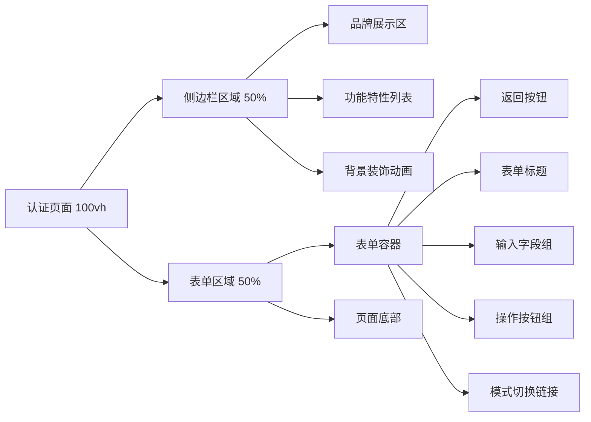

# 登录页面实现设计

## 概述

本设计文档定义笔记管理系统登录页面的架构设计，包括用户界面布局、身份验证流程、状态管理和用户体验优化。登录页面作为用户进入系统的第一入口，承担着身份验证、安全控制和用户引导的核心职责。

### 设计目标

- **安全第一**: 实现安全的身份验证机制和数据保护
- **用户体验**: 提供直观、响应迅速的交互体验
- **可访问性**: 支持键盘导航和屏幕阅读器
- **性能优化**: 快速加载和响应式设计
- **错误友好**: 清晰的错误提示和恢复指导

## 技术栈

### 核心框架

| 技术 | 版本 | 用途描述 |
|------|------|----------|
| React | ^19.1.1 | UI组件框架，提供声明式界面构建 |
| TypeScript | ~5.8.3 | 类型安全保障，提升代码质量 |
| React Hook Form | ^7.50.1 | 高性能表单状态管理，减少重渲染 |
| Zod | ^3.22.4 | 模式验证库，确保数据类型安全 |

### 认证与状态管理

| 组件 | 功能 |
|------|------|
| AuthContext | 全局认证状态管理，提供统一的认证接口 |
| AuthService | 封装认证API调用，处理网络请求和错误 |
| JWT工具类 | 令牌解析、验证和过期检查 |
| 存储管理器 | 安全的令牌存储和读取策略 |

## 组件架构

### 组件层次图



### 组件定义

#### AuthPage (认证页面容器)

**职责定义**:
- 管理认证模式切换（登录/注册/重置密码）
- 提供统一的页面布局和视觉设计
- 处理路由状态和页面导航
- 响应式布局适配

**状态管理**:
```
interface AuthPageState {
  currentMode: AuthMode;           // 当前认证模式
  isTransitioning: boolean;        // 模式切换动画状态
}
```

**模式切换流程**:
1. 用户触发模式切换事件
2. 清理当前表单状态和错误信息
3. 执行页面切换动画
4. 渲染目标模式组件
5. 更新浏览器历史记录

#### LoginForm (登录表单核心)

**表单架构**:
| 字段名 | 类型 | 验证规则 | 错误处理 |
|--------|------|----------|----------|
| email | string | 邮箱格式 + 非空 | 实时验证，错误高亮 |
| password | string | 最小长度 + 非空 | 失焦验证，安全提示 |
| rememberMe | boolean | 可选 | 影响令牌存储策略 |

**验证策略**:
- **即时验证**: 字段失焦时触发验证，提供即时反馈
- **提交验证**: 表单提交前进行完整验证
- **动态清理**: 用户开始输入时自动清除错误状态
- **服务端验证**: 处理后端返回的验证错误

**交互增强**:
- 密码可见性切换（眼睛图标）
- 自动完成支持（邮箱和密码）
- 键盘快捷键支持（Enter提交）
- 加载状态视觉反馈

## 状态管理架构

### 认证状态流转



### AuthContext 状态结构

```typescript
interface AuthState {
  // 认证状态
  isAuthenticated: boolean;
  isInitialized: boolean;
  
  // 用户信息
  user: User | null;
  
  // 令牌管理
  token: string | null;
  refreshToken: string | null;
  tokenExpiryTime: number | null;
  
  // UI状态
  loading: boolean;
  error: AuthError | null;
  
  // 配置选项
  rememberMe: boolean;
}
```

### 状态操作定义

| 操作类型 | 触发条件 | 状态变更 |
|----------|----------|----------|
| AUTH_INIT_START | 应用启动 | loading: true |
| AUTH_LOGIN_SUCCESS | 登录成功 | isAuthenticated: true, user设置 |
| AUTH_LOGIN_FAILURE | 登录失败 | error设置，loading: false |
| AUTH_TOKEN_REFRESH | 令牌刷新 | 更新token和过期时间 |
| AUTH_LOGOUT | 用户登出 | 重置为初始状态 |
| AUTH_CLEAR_ERROR | 清除错误 | error: null |

## API设计与集成

### 认证服务接口

#### 用户登录接口

**请求规范**:
```
POST /api/auth/login
Content-Type: application/json

{
  "email": "user@example.com",
  "password": "securePassword123",
  "rememberMe": true
}
```

**成功响应**:
```
HTTP 200 OK
{
  "success": true,
  "data": {
    "token": "eyJhbGciOiJIUzI1NiIs...",
    "refreshToken": "refresh_token_string",
    "user": {
      "id": "user-uuid",
      "email": "user@example.com",
      "username": "用户名",
      "avatar": "avatar_url",
      "preferences": {...}
    },
    "expiresIn": 3600
  }
}
```

**错误响应处理**:
| HTTP状态码 | 错误类型 | 用户提示 | 处理策略 |
|------------|----------|----------|----------|
| 400 | 请求格式错误 | "请检查输入信息" | 显示字段级错误 |
| 401 | 凭据无效 | "邮箱或密码错误" | 清除密码字段 |
| 423 | 账户锁定 | "账户已被锁定，请联系管理员" | 显示帮助信息 |
| 429 | 请求过频 | "登录尝试过于频繁，请稍后重试" | 显示倒计时 |
| 500 | 服务器错误 | "服务暂时不可用，请稍后重试" | 提供重试按钮 |

### 令牌管理策略

#### 自动刷新机制

**刷新时机**:
- 令牌过期前5分钟自动刷新
- 页面重新获得焦点时检查
- 发起API请求前验证令牌有效性

**刷新流程**:
1. 检测令牌即将过期
2. 使用refreshToken调用刷新接口
3. 更新本地存储的令牌
4. 重试原始API请求
5. 刷新失败时引导用户重新登录

#### 存储安全策略

| 存储方式 | 使用场景 | 安全考虑 | 过期策略 |
|----------|----------|----------|----------|
| SessionStorage | 未选择"记住我" | 标签页关闭后清除 | 会话结束 |
| LocalStorage | 选择"记住我" | 设置过期时间戳 | 30天自动清除 |
| Memory | 敏感操作期间 | 页面刷新后清除 | 立即失效 |

## 用户界面设计

### 布局架构



### 视觉设计原则

#### 色彩系统

| 用途 | 颜色值 | 应用场景 |
|------|--------|----------|
| 主色调 | #3b82f6 | 按钮、链接、焦点状态 |
| 成功色 | #10b981 | 成功提示、验证通过 |
| 错误色 | #ef4444 | 错误提示、验证失败 |
| 警告色 | #f59e0b | 警告信息、注意事项 |
| 中性色 | #6b7280 | 文本、边框、背景 |

#### 间距系统

- **组件间距**: 24px (1.5rem)
- **字段间距**: 16px (1rem)
- **内容边距**: 32px (2rem)
- **页面边距**: 48px (3rem)

#### 字体层级

| 层级 | 字体大小 | 字重 | 用途 |
|------|----------|------|------|
| H1 | 2rem | 700 | 页面主标题 |
| H2 | 1.5rem | 600 | 区域标题 |
| H3 | 1.25rem | 500 | 小节标题 |
| Body | 1rem | 400 | 正文内容 |
| Small | 0.875rem | 400 | 辅助信息 |

### 交互动效设计

#### 页面切换动画

**入场动画**:
- 表单容器：从右侧滑入，透明度从0到1
- 动画时长：300ms
- 缓动函数：ease-out

**离场动画**:
- 表单容器：向左侧滑出，透明度从1到0
- 动画时长：200ms
- 缓动函数：ease-in

#### 表单交互反馈

**字段焦点状态**:
- 边框颜色变化：#d1d5db → #3b82f6
- 阴影效果：添加蓝色光晕
- 图标颜色：#9ca3af → #3b82f6

**按钮交互状态**:
- 悬停：背景色加深10%
- 点击：轻微缩放效果 (scale: 0.98)
- 加载：旋转图标动画

**错误状态动画**:
- 错误提示：从上方滑入，带轻微弹跳
- 错误字段：轻微左右摇摆动画
- 持续时间：500ms

## 性能优化策略

### 代码分割与懒加载

**组件级分割**:
- 登录表单作为独立chunk
- 注册和重置密码表单按需加载
- 第三方库独立打包

**资源优化**:
- 图标使用SVG sprites
- 样式文件按功能模块分割
- 字体文件子集化

### 渲染性能优化

**React优化措施**:
- 使用React.memo防止不必要的重渲染
- 使用useCallback和useMemo缓存函数和计算结果
- 表单字段采用非受控组件减少渲染次数

**状态管理优化**:
- AuthContext状态拆分，避免全局重渲染
- 使用useReducer替代多个useState
- 错误状态和加载状态独立管理

### 网络请求优化

**请求策略**:
- 实施请求去重，防止重复提交
- 使用AbortController支持请求取消
- 实现指数退避重试机制

**缓存策略**:
- 用户信息本地缓存30分钟
- API响应headers缓存控制
- 离线状态检测和处理

## 安全实现方案

### 客户端安全措施

#### 输入验证与清理

**XSS防护**:
- 所有用户输入进行HTML转义
- 使用DOMPurify清理危险内容
- CSP策略限制脚本执行

**注入攻击防护**:
- 参数化查询，避免SQL注入
- 输入长度限制和格式验证
- 特殊字符过滤和编码

#### 令牌安全管理

**存储安全**:
- 令牌使用HttpOnly Cookie存储（生产环境）
- LocalStorage仅存储非敏感标识
- 定期清理过期令牌和敏感数据

**传输安全**:
- 所有请求强制HTTPS
- 请求头添加CSRF令牌
- API响应签名验证

### 会话管理安全

#### 多设备登录控制

**并发会话策略**:
- 最多允许3个并发会话
- 新设备登录时推送通知
- 异常登录位置检测和警告

**会话失效机制**:
- 30分钟无操作自动失效
- 检测到安全威胁时强制登出
- 定期刷新会话密钥

## 可访问性设计

### 键盘导航支持

**导航顺序**:
1. 邮箱输入框
2. 密码输入框
3. 密码可见性切换按钮
4. 记住我复选框
5. 登录按钮
6. 忘记密码链接
7. 注册链接

**快捷键支持**:
- Tab/Shift+Tab: 焦点切换
- Enter: 提交表单
- Escape: 关闭错误提示
- Space: 切换复选框状态

### 屏幕阅读器优化

**ARIA标签配置**:
```html
<form role="form" aria-labelledby="login-title">
  <h2 id="login-title">用户登录</h2>
  
  <input 
    aria-label="邮箱地址"
    aria-describedby="email-error"
    aria-invalid={hasError}
  />
  
  <div id="email-error" role="alert" aria-live="polite">
    错误信息
  </div>
</form>
```

**状态公告**:
- 登录成功/失败状态实时播报
- 加载状态变化通知
- 错误信息清晰描述

### 视觉辅助功能

**对比度要求**:
- 文本与背景对比度 ≥ 4.5:1
- 错误文本对比度 ≥ 7:1
- 交互元素边界清晰可见

**字体缩放支持**:
- 支持浏览器字体缩放至200%
- 布局在放大后保持可用性
- 关键信息不会被截断

## 响应式设计实现

### 断点策略

| 设备类型 | 屏幕宽度 | 布局调整 | 特殊优化 |
|----------|----------|----------|----------|
| 手机 | < 768px | 单栏垂直布局 | 简化侧边栏，增大触摸区域 |
| 平板 | 768px - 1024px | 紧凑双栏布局 | 优化横屏显示 |
| 笔记本 | 1024px - 1440px | 标准双栏布局 | 平衡内容密度 |
| 桌面 | > 1440px | 宽屏优化布局 | 增加视觉装饰 |

### 移动端优化

**触摸交互优化**:
- 按钮最小尺寸44px
- 输入框高度48px
- 触摸区域间距12px以上

**移动端特性利用**:
- 自动聚焦首个输入框
- 键盘类型优化（email输入显示@符号）
- 支持生物识别登录（指纹/面部）

**性能优化**:
- 减少动画复杂度
- 优化图片加载和尺寸
- 懒加载非关键资源

## 测试覆盖策略

### 单元测试

#### 组件测试范围

**LoginForm组件**:
- 表单字段渲染正确性
- 验证规则触发和错误显示
- 用户交互事件处理
- 状态变化和副作用

**AuthContext测试**:
- 状态初始化逻辑
- 登录/登出状态变化
- 令牌刷新机制
- 错误处理和恢复

#### 工具函数测试

**验证工具**:
- 邮箱格式验证准确性
- 密码强度检测逻辑
- 输入清理和格式化

**JWT工具**:
- 令牌解析和验证
- 过期时间计算
- 签名验证逻辑

### 集成测试

#### 用户流程测试

**完整登录流程**:
1. 用户输入有效凭据
2. 表单验证通过
3. API调用成功
4. 状态更新正确
5. 页面重定向发生

**错误处理流程**:
1. 用户输入无效凭据
2. API返回错误响应
3. 错误信息正确显示
4. 用户可以重新尝试

#### API集成测试

**网络请求测试**:
- 成功登录场景
- 各种错误响应处理
- 网络超时和重试
- 并发请求处理

### 端到端测试

#### 用户体验测试

**多设备测试**:
- 桌面浏览器兼容性
- 移动设备响应式布局
- 平板横屏/竖屏切换
- 不同屏幕分辨率适配

**可访问性测试**:
- 键盘导航完整性
- 屏幕阅读器兼容性
- 高对比度模式支持
- 字体缩放测试

#### 性能测试

**加载性能**:
- 首屏渲染时间 < 1.5s
- 交互响应时间 < 100ms
- 资源加载优化验证

**压力测试**:
- 并发用户登录处理
- 高频请求场景测试
- 内存泄漏检测