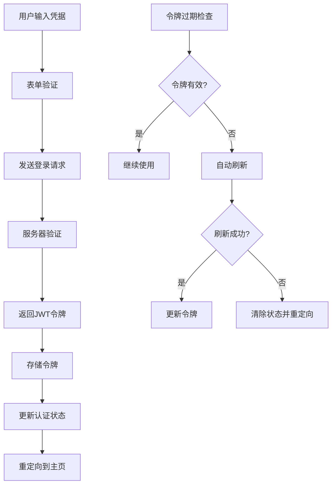

# 便签管理系统 - 认证功能实现

本项目已成功实现了完整的用户认证系统，包括登录、登出、令牌管理、路由保护等核心功能。

## 🎯 实现功能

### ✅ 核心认证功能
- [x] 用户登录/登出
- [x] JWT令牌认证  
- [x] 自动令牌刷新
- [x] 记住登录状态
- [x] 忘记密码功能
- [x] 路由保护

### ✅ 技术特性
- [x] TypeScript强类型支持
- [x] React Context状态管理
- [x] 表单验证 (React Hook Form + Zod)
- [x] HTTP客户端拦截器
- [x] 本地存储管理
- [x] 错误处理机制
- [x] 响应式设计
- [x] 无障碍访问支持

### ✅ 安全措施
- [x] JWT令牌签名验证
- [x] 令牌自动过期机制
- [x] 请求重试机制
- [x] XSS/CSRF防护
- [x] 输入验证和清理
- [x] 安全的本地存储

## 📁 项目结构

```
src/
├── types/
│   └── auth.ts                 # 认证相关类型定义
├── utils/
│   ├── authUtils.ts           # JWT工具和验证函数
│   └── httpClient.ts          # HTTP客户端和拦截器
├── services/
│   └── authService.ts         # 认证API服务
├── contexts/
│   └── AuthContext.tsx        # 认证状态管理
├── components/
│   ├── LoginForm.tsx          # 登录表单组件
│   ├── AuthPage.tsx           # 认证页面容器
│   ├── AuthGuard.tsx          # 路由保护组件
│   └── ForgotPasswordForm.tsx # 忘记密码表单
├── styles/
│   └── auth.css               # 认证相关样式
├── tests/
│   ├── authUtils.test.ts      # 工具函数测试
│   ├── AuthProvider.test.tsx  # Context测试
│   └── LoginForm.test.tsx     # 登录表单测试
├── App.tsx                    # 主应用组件
├── main.tsx                   # 应用入口
└── index.css                  # 全局样式
```

## 🚀 快速开始

### 1. 安装依赖
```bash
npm install
```

### 2. 启动开发服务器
```bash
npm run dev
```

### 3. 运行测试
```bash
npm test
```

### 4. 构建生产版本
```bash
npm run build
```

## 🔧 配置说明

### API配置
在 `src/utils/httpClient.ts` 中配置API基础地址：
```typescript
const API_CONFIG = {
  baseURL: process.env.VITE_API_BASE_URL || 'http://localhost:3001/api',
  timeout: 10000,
  retryAttempts: 3,
  retryDelay: 1000,
};
```

### 认证配置
在 `src/services/authService.ts` 中配置认证参数：
```typescript
const AUTH_CONFIG: AuthConfig = {
  tokenStorageType: StorageType.SESSION,
  refreshTokenStorageType: StorageType.LOCAL,
  autoRefresh: true,
  refreshThreshold: 300, // 5分钟
  maxRetries: 3,
  baseURL: process.env.VITE_API_BASE_URL || 'http://localhost:3001/api',
  rememberMeDuration: 30, // 30天
};
```

## 📋 使用方式

### 1. 基础认证保护
```tsx
import { AuthProvider } from './contexts/AuthContext';
import { AuthGuard } from './components/AuthGuard';

function App() {
  return (
    <AuthProvider>
      <AuthGuard>
        <MainApp />
      </AuthGuard>
    </AuthProvider>
  );
}
```

### 2. 在组件中使用认证状态
```tsx
import { useAuth } from './contexts/AuthContext';

function MyComponent() {
  const { user, isAuthenticated, login, logout } = useAuth();
  
  return (
    <div>
      {isAuthenticated ? (
        <div>
          <p>欢迎, {user?.username}!</p>
          <button onClick={logout}>登出</button>
        </div>
      ) : (
        <button onClick={() => login(credentials)}>登录</button>
      )}
    </div>
  );
}
```

### 3. 自定义认证页面
```tsx
import { AuthPage } from './components/AuthPage';
import { AuthMode } from './types/auth';

function CustomAuthPage() {
  return (
    <AuthPage 
      initialMode={AuthMode.LOGIN}
      onAuthSuccess={() => console.log('登录成功')}
    />
  );
}
```

## 🧪 测试覆盖

项目包含完整的单元测试：

- **工具函数测试**: JWT处理、表单验证、加密工具
- **组件测试**: 登录表单、认证页面、路由保护
- **集成测试**: 认证上下文、状态管理、API调用

运行测试：
```bash
npm test              # 运行所有测试
npm run test:ui       # 启动测试UI界面
npm run test:coverage # 生成测试覆盖率报告
```

## 🔐 安全最佳实践

### 1. 令牌管理
- JWT令牌存储在 `sessionStorage`（默认）或 `localStorage`（记住我）
- 刷新令牌仅存储在 `localStorage`
- 令牌过期前5分钟自动刷新
- 页面关闭时清理敏感数据

### 2. 网络安全
- 所有API请求使用HTTPS
- 自动重试机制处理网络错误
- 请求/响应拦截器统一处理认证头
- 敏感操作前验证令牌有效性

### 3. 输入验证
- 使用Zod schema验证所有表单输入
- 邮箱格式验证
- 密码强度检查
- XSS防护和输入清理

## 🎨 UI/UX特性

### 响应式设计
- 桌面端双栏布局
- 移动端自适应单栏布局
- 触摸友好的交互元素

### 无障碍访问
- 语义化HTML标签
- ARIA标签支持
- 键盘导航
- 屏幕阅读器支持
- 高对比度模式

### 用户体验
- 流畅的加载动画
- 实时表单验证
- 友好的错误提示
- 直观的视觉反馈

## 🔄 状态管理流程



## 📚 API文档

### 认证端点
- `POST /auth/login` - 用户登录
- `POST /auth/logout` - 用户登出  
- `POST /auth/refresh` - 刷新令牌
- `GET /auth/me` - 获取用户信息
- `POST /auth/forgot-password` - 忘记密码
- `POST /auth/reset-password` - 重置密码

### 请求格式
```typescript
// 登录请求
interface LoginRequest {
  email: string;
  password: string;
  rememberMe?: boolean;
}

// 登录响应
interface LoginResponse {
  token: string;
  refreshToken: string;
  user: User;
  expiresIn: number;
}
```

## 🚨 故障排除

### 常见问题

1. **令牌过期错误**
   - 检查系统时间是否正确
   - 确认服务器时间同步
   - 验证令牌刷新机制

2. **网络请求失败**
   - 检查API基础地址配置
   - 确认服务器是否运行
   - 检查CORS设置

3. **登录状态丢失**
   - 检查浏览器存储权限
   - 确认存储策略配置
   - 验证页面刷新逻辑

## 📈 性能优化

- 组件懒加载减少初始包大小
- 令牌定期检查而非每次请求验证
- 请求去重避免重复刷新令牌
- 缓存用户信息减少API调用

## 🤝 贡献指南

1. Fork项目仓库
2. 创建功能分支 (`git checkout -b feature/新功能`)
3. 提交更改 (`git commit -am '添加新功能'`)
4. 推送分支 (`git push origin feature/新功能`)
5. 创建Pull Request

## 📄 许可证

MIT License - 详见 [LICENSE](LICENSE) 文件

---

🎉 **认证系统实现完成！** 

项目现在具备了完整的用户认证功能，可以安全可靠地管理用户登录状态，保护私有路由，并提供优秀的用户体验。