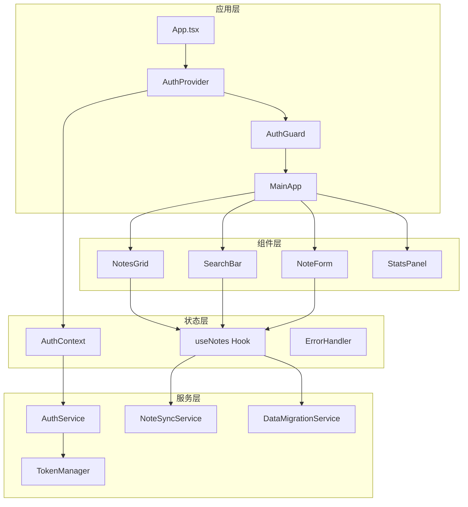

# 便签管理系统 📝

> 基于 React + TypeScript 的现代化便签管理应用，提供完整的用户认证、数据同步、离线支持等企业级功能。

[](https://reactjs.org/)
[](https://www.typescriptlang.org/)
[](https://vitejs.dev/)
[](https://vitest.dev/)
[](LICENSE)

## ✨ 特性

### 🔐 完整的认证系统
- JWT 令牌管理与自动刷新
- 用户注册、登录、密码重置
- 安全的会话管理
- 记住我功能

### 📋 强大的便签功能
- 创建、编辑、删除便签
- 多彩便签主题
- 智能标签系统
- 高级搜索与过滤
- 批量操作支持

### 🔄 智能数据同步
- 实时云端同步
- 离线模式支持
- 冲突解决机制
- 自动数据迁移
- 版本控制

### 🎨 现代化UI设计
- 响应式布局
- 流畅的动画效果
- 深色/浅色主题
- 可访问性支持
- 移动端优化

### 🛡️ 企业级质量
- 完整的错误处理
- 性能监控系统
- 全面的单元测试
- TypeScript 类型安全
- 代码质量保证

## 🚀 快速开始

### 环境要求

- Node.js >= 18.0.0
- npm >= 9.0.0 或 yarn >= 1.22.0
- 现代浏览器支持 (Chrome, Firefox, Safari, Edge)

### 安装

```bash
# 克隆项目
git clone https://github.com/your-username/note-manager.git
cd note-manager

# 安装依赖
npm install

# 启动开发服务器
npm run dev
```

### 构建

```bash
# 生产构建
npm run build

# 预览构建结果
npm run preview
```

### 测试

```bash
# 运行测试
npm run test

# 测试覆盖率
npm run test:coverage

# 测试UI
npm run test:ui
```

## 📁 项目结构

```
src/
├── components/          # UI 组件
│   ├── AuthGuard.tsx   # 认证守卫
│   ├── ErrorBoundary.tsx # 错误边界
│   ├── NoteCard.tsx    # 便签卡片
│   ├── NoteForm.tsx    # 便签表单
│   ├── NotesGrid.tsx   # 便签网格
│   ├── SearchBar.tsx   # 搜索栏
│   └── ...
├── contexts/           # React Context
│   └── AuthContext.tsx # 认证上下文
├── hooks/              # 自定义 Hook
│   └── useNotes.ts     # 便签管理Hook
├── services/           # 业务服务
│   ├── authService.ts  # 认证服务
│   ├── dataMigrationService.ts # 数据迁移
│   ├── errorHandler.ts # 错误处理
│   ├── noteSyncService.ts # 同步服务
│   └── tokenManager.ts # 令牌管理
├── types/              # TypeScript 类型
│   ├── auth.ts         # 认证类型
│   └── note.ts         # 便签类型
├── utils/              # 工具函数
│   ├── authUtils.ts    # 认证工具
│   ├── httpClient.ts   # HTTP客户端
│   └── performanceMonitor.ts # 性能监控
└── tests/              # 测试文件
    ├── useNotes.test.tsx
    ├── authService.test.ts
    └── ...
```

## 🏗️ 架构设计

### 技术栈

| 技术 | 版本 | 用途 |
|------|------|------|
| React | 19.1.1 | 前端框架 |
| TypeScript | 5.8.3 | 类型系统 |
| Vite | 7.1.7 | 构建工具 |
| React Hook Form | 7.50.1 | 表单处理 |
| Zod | 3.22.4 | 数据验证 |
| Axios | 1.6.7 | HTTP客户端 |
| Lucide React | 0.544.0 | 图标库 |
| Vitest | 1.3.1 | 测试框架 |

### 核心架构



## 🔧 核心功能

### 认证系统

```typescript
// 使用认证Hook
const { user, login, logout, isAuthenticated } = useAuth();

// 登录
await login({
  email: 'user@example.com',
  password: 'password',
  rememberMe: true
});
```

### 便签管理

```typescript
// 使用便签Hook
const { 
  notes, 
  createNote, 
  updateNote, 
  deleteNote,
  setFilter 
} = useNotes();

// 创建便签
const newNote = createNote({
  title: '新便签',
  content: '便签内容',
  color: '#FFE5B4',
  tags: ['工作', '重要']
});
```

### 数据同步

```typescript
// 自动同步配置
const syncConfig = {
  autoSync: true,
  syncInterval: 30000, // 30秒
  retryAttempts: 3,
  batchSize: 10
};

// 手动同步
await forceSyncNotes();
```

## 🧪 测试策略

### 测试覆盖范围

- **单元测试**: 覆盖所有工具函数和Hook
- **组件测试**: 覆盖所有UI组件的交互
- **集成测试**: 覆盖完整的用户流程
- **性能测试**: 监控渲染性能和内存使用

### 测试示例

```typescript
// Hook测试
it('应该正确创建新便签', () => {
  const { result } = renderHook(() => useNotes());
  
  act(() => {
    const newNote = result.current.createNote({
      title: '测试便签',
      content: '测试内容',
      color: '#FFE5B4',
      tags: ['测试']
    });
    
    expect(newNote).toBeDefined();
    expect(newNote.title).toBe('测试便签');
  });
});
```

## 📊 性能优化

### 优化策略

1. **代码分割**: 组件级懒加载
2. **内存管理**: 防止内存泄漏
3. **渲染优化**: useMemo/useCallback
4. **网络优化**: 请求缓存和去重
5. **包大小优化**: Tree shaking

### 性能监控

```typescript
// 使用性能监控
const { measureRender, getReport } = usePerformanceMonitor();

// 测量组件渲染时间
const endMeasure = measureRender('MyComponent').start();
// 组件渲染...
endMeasure();

// 获取性能报告
const report = getReport();
console.log('性能得分:', report.score);
```

## 🛡️ 安全特性

### 数据安全
- JWT令牌安全存储
- XSS攻击防护
- CSRF保护
- 输入验证和清理

### 隐私保护
- 本地数据加密
- 敏感信息脱敏
- 用户数据控制
- GDPR合规支持

## 🌐 浏览器支持

| 浏览器 | 版本 |
|--------|------|
| Chrome | >= 88 |
| Firefox | >= 78 |
| Safari | >= 14 |
| Edge | >= 88 |

## 📈 开发指南

### 代码规范

- 使用 TypeScript 严格模式
- 遵循 ESLint 规则
- 组件采用函数式编程
- Hook 优先于 Class 组件

### 提交规范

```bash
# 功能开发
git commit -m "feat: 添加便签搜索功能"

# 问题修复
git commit -m "fix: 修复同步冲突问题"

# 文档更新
git commit -m "docs: 更新API文档"
```

### 开发流程

1. 创建功能分支
2. 开发功能并编写测试
3. 运行测试确保通过
4. 提交代码并创建PR
5. 代码审查通过后合并

## 📋 API 文档

### 认证接口

```typescript
// 登录
POST /api/auth/login
{
  "email": "user@example.com",
  "password": "password",
  "rememberMe": true
}

// 刷新令牌
POST /api/auth/refresh
{
  "refreshToken": "refresh_token_here"
}
```

### 便签接口

```typescript
// 获取便签列表
GET /api/notes

// 创建便签
POST /api/notes
{
  "title": "便签标题",
  "content": "便签内容",
  "tags": ["标签1", "标签2"]
}

// 更新便签
PUT /api/notes/:id
{
  "title": "更新的标题",
  "content": "更新的内容"
}
```

## 🤝 贡献指南

我们欢迎所有形式的贡献！

### 如何贡献

1. Fork 本仓库
2. 创建你的特性分支 (`git checkout -b feature/AmazingFeature`)
3. 提交你的修改 (`git commit -m 'Add some AmazingFeature'`)
4. 推送到分支 (`git push origin feature/AmazingFeature`)
5. 打开一个 Pull Request

### 贡献类型

- 🐛 Bug 修复
- ✨ 新功能开发
- 📝 文档改进
- 🎨 UI/UX 优化
- ⚡ 性能优化
- 🧪 测试补充

## 📄 许可证

本项目采用 MIT 许可证 - 查看 [LICENSE](LICENSE) 文件了解详情。

## 👥 作者

- **开发者** - [您的名字](https://github.com/your-username)

## 🙏 致谢

感谢以下开源项目:

- [React](https://reactjs.org/) - 用户界面库
- [TypeScript](https://www.typescriptlang.org/) - JavaScript超集
- [Vite](https://vitejs.dev/) - 构建工具
- [Vitest](https://vitest.dev/) - 测试框架
- [Lucide](https://lucide.dev/) - 图标库

## 📞 支持

如果你觉得这个项目有帮助，请给我们一个 ⭐!

- 📧 邮箱: support@notemanager.com
- 🐛 问题报告: [GitHub Issues](https://github.com/your-username/note-manager/issues)
- 💬 讨论: [GitHub Discussions](https://github.com/your-username/note-manager/discussions)

---

<div align="center">
  <p>用 ❤️ 构建 | © 2025 便签管理系统</p>
</div>